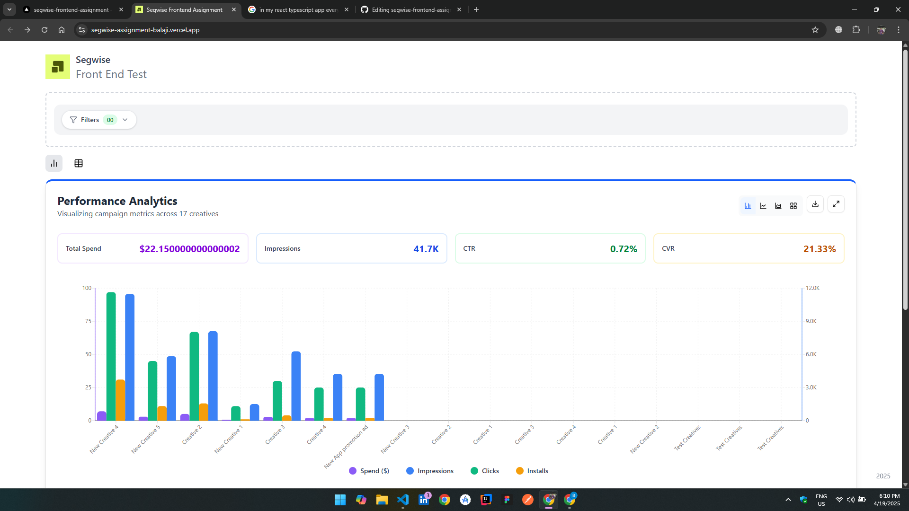
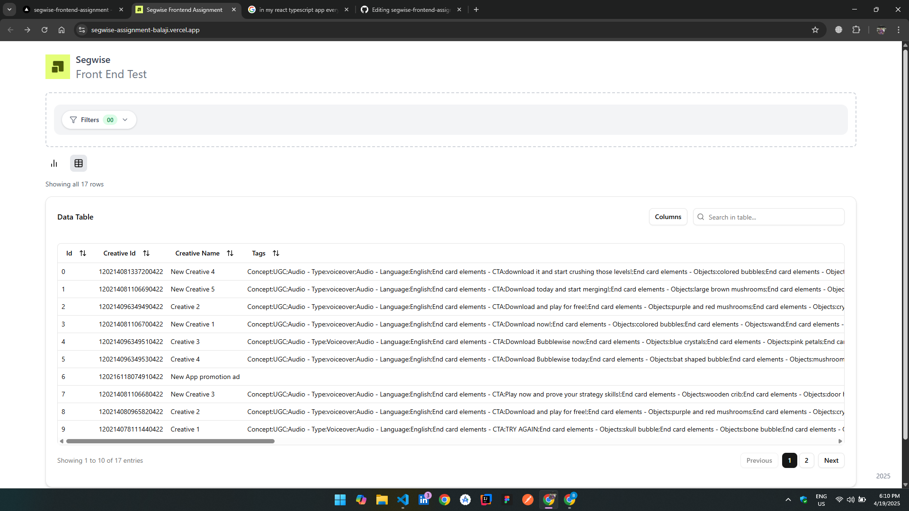
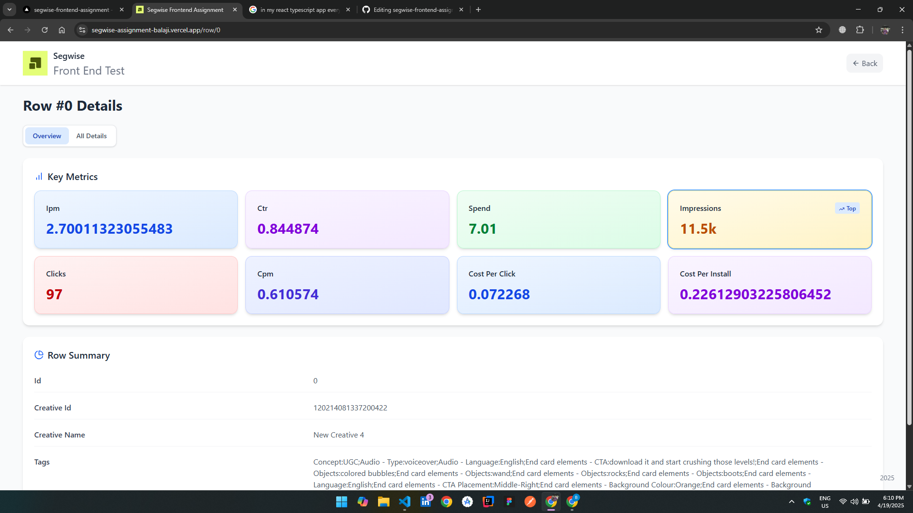

# Segwise Frontend Test

> A pixel-perfect implementation of the Figma design with interactive data visualizations for spends, impressions, clicks, and installs.

## 🚀 Key Features

- 🔍 **Search & Filter**: Quickly search, sort, and apply multiple filters to your data.
- 📊 **Interactive Charts**: Visualize spends, impressions, clicks, and installs with dynamic graphs.
- ⚡ **Fast CSV Parsing**: Leverages [PapaParse](https://www.papaparse.com/) for lightning-fast data retrieval from CSV.
- - 👀 **Row Preview Available**: Instantly view detailed data for any row with a single click.
- 📄 **Pagination Implemented**: Seamlessly navigate large datasets with efficient pagination.

## 🛠 Technologies Used

<p align="center">
  <a href="https://vitejs.dev/">
    
  </a>
  <a href="https://reactjs.org/">
    
  </a>
  <a href="https://www.typescriptlang.org/">
    
  </a>
  <a href="https://tailwindcss.com/">
    
  </a>
  <a href="https://www.npmjs.com/package/papaparse">
    
  </a>
  <a href="https://ui.shadcn.com/">
    
  </a>
</p>

# 🧰 Technology Overview

Segwise Frontend Test website is built with a modern, lightning-fast stack:
- **Vite**: Provides instant Hot Module Replacement (HMR) and ultra-fast build times.
- **React**: A declarative, component-based library for building dynamic UIs.
- **TypeScript**: Adds static typing for safer and more maintainable code.
- **Tailwind CSS**: A utility-first CSS framework for rapid, responsive styling.
- **shadcn/ui**: A set of accessible, customizable UI components built on Radix and Tailwind.
- **PapaParse**: Efficient CSV parsing in the browser, enabling fast data loading.

## 📦 Installation

```bash
# Clone the repository
git clone https://github.com/your-username/segwise-frontend-test.git
cd segwise-frontend-test

# Install dependencies
npm install

# Start the development server
npm run dev
```

## 📋 Usage

1. Open your browser and navigate to `http://localhost:5173`
2. Use the search bar or filter panel to narrow down data.
3. Toggle between **Table** and **Chart** views to explore different representations.
4. Click on any data row to view detailed insights.

## 📝 Project Structure

```plaintext
src/
├── assets/           # Static files (logo, icons)
├── components/       # Reusable UI components
│   ├── DataTable.tsx
│   ├── ChartView.tsx
│   ├── FilterBar.tsx
│   └── Footer.tsx
├── data/             # CSV and raw data files
├── pages/            # Route-level components
│   ├── Home.tsx
│   └── RowDetail.tsx
├── App.tsx           # App entry & routing
└── main.tsx          # Vite entry point
```

---

## 🚀 Live Demo

Experience Segwise in action: [View the Live Demo](https://segwise-assignment-balaji.vercel.app/) 🌐

---

## 📸 Screenshots

<p align="center">
  
  
  
</p>

---

## 💡 My Learnings in this test

- **During this frontend development I learnt a new package Papaparse for csv reader.**
- **Learned and implemented shadcn ui during this development test**
- **Thanks for the opportunity given by Segwise.ai hope I did my test well and I am waiting for my results**.
